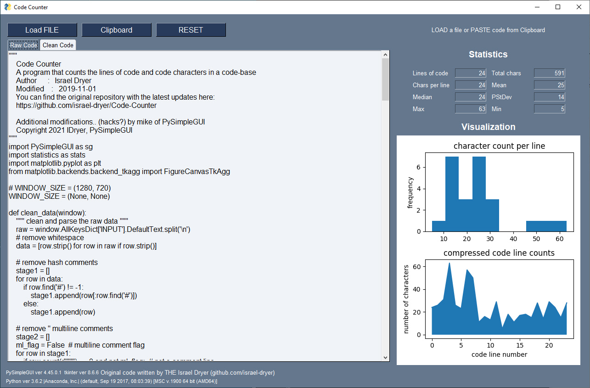

# Code-Counter (in progress)
A simple program that strips comments and whitespace from a code file and provides summary statistics. 
  
When you load Python code from either a **file** or from the **clipboard** your code will be instantly cleaned and measured. There are tabs for the original **Raw Code** and the new **Clean Code**.    

This version is a modified version based on the code from Isreal Dryer that you can find here:

https://github.com/israel-dryer/Code-Counter

   

Mike's mods include:

* Reading the clipboard upon launch (assume it's already got a file ready to process on it)
* Doesn't write to a .txt file the compressed code
* Made key names match the PSG Coding Conventions
* Personal prefs that are of no real importance to anything
* Capabilities not present when Israel wrote the original code 2 years ago (which still runs BTW, a testament to his code and PSG's backward compat)
